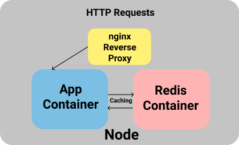

# havoc-v2-rest-api
 
 \<root_url\> = [https://api-havoc-v2.herokuapp.com/](https://api-havoc-v2.herokuapp.com/)

## Installing Dependencies
`npm install`

## Starting the API Server
`npm run dev`

## Supported API Endpoints:

### 1. \<root_url\>/devices

    Returns a list of supported devices in the JSON format.

### 2. \<root_url\>/devices/\<deviceCodename\>

    Returns information about a particular device specified by the <deviceCodename> slug field. 

### 3. \<root_url\>/about

    Returns a list of developers currently involved with the project in JSON format.

### 3. \<root_url\>/about/\<developerId\>

    Returns details regarding a particular developer identified by the <developerId> slug field.

## Testing the APIs:

1. Using [POSTMAN](https://www.postman.com/).

    POSTMAN is a GUI API Testing. It can be used for easily testing our APIs. You can read more about it in the above link.

2. Using [cURL](https://curl.haxx.se/).

    cURL is a command-line program which comes preinstalled with most Linux Distros. If you do not want to go through the extra hassle of setting up a separate application for API testing, you can use this option instead.

    Ex:

    `curl -X GET -H "Accept: application/json" <root_url>/about | json_pp`

    #### -X GET -> (Sets the HTTP Request type to GET)
    #### -H "Accept: application/json" -> (Sets HTTP Request Header Attribute)
    #### <root_url>/about -> (Request URL)
    #### json_pp -> (Formats curl output into a readable JSON format)

    The above command would return a list of developers currently involved with the project.

## Using Docker to run the application:

    Prerequisites:
    1. docker (dependency of docker-compose)
    2. docker-compose

`sudo docker-compose up`

The above command will setup all the necessary containers on your system to run the application.

Presently, the application depends on 2 containers to run properly:

1. **redis** (used for **caching**).
2. The **app** itself (the container for the app is built automatically when the above command is run).

To stop and remove the running containers:

`sudo docker-compose down`

## References:

1. [REST API Tutorial Series](https://www.youtube.com/playlist?list=PL55RiY5tL51q4D-B63KBnygU6opNPFk_q).
2. [GraphQL API Tutorial Series](https://www.youtube.com/playlist?list=PL55RiY5tL51rG1x02Yyj93iypUuHYXcB_).